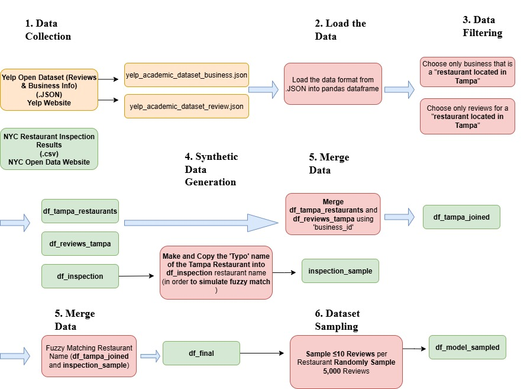

# 🏙️ Tampa Restaurant Review & Health Inspection Analysis

This repository contains a data analysis project combining **Yelp reviews** with a simulated **Tampa health inspection dataset**, aiming to explore sentiment trends and possible correlations with health grades and violations.

---

## 📂 Files Included

| File Name                     | Description |
|------------------------------|-------------|
| `health_risk_pred.ipynb`     | Main Jupyter notebook containing full data processing, sentiment analysis, EDA, and risk prediction. |
| `requirements.txt`           | Python package dependencies. |
| `df_model_sampled2.csv`      | Processed dataset after sampling. |
| `sentimen_df_model_sampled.csv` | Dataset with BERT-based sentiment prediction results. |

---

## 🔍 Project Objectives

- Merge restaurant inspection data with Yelp reviews (focus on restaurants in **Tampa**).
- Simulate fuzzy name matching between business datasets.
- Apply sentiment analysis using **DistilBERT (HuggingFace)** on customer reviews.
- Compare sentiment results against health inspection outcomes (e.g., grade, score).
- Visualize commonly used words in **positive vs negative reviews**.

---

## 🔧 Key Steps

1. **Data Gathering**  
   Collected datasets from Yelp (JSON) and simulated Tampa health inspections (based on NYC inspections).

2. **Data Cleaning & Preprocessing**  
   - Extracted Tampa-based reviews.  
   - Created fuzzy-matched business names.  
   - Standardized date formats and grades.  

3. **Data Merging**  
   Performed inner join between Yelp and inspection datasets using fuzzy matching logic.

4. **Sentiment Analysis**  
   Applied BERT-based classifier to Yelp reviews to label them as **POSITIVE** or **NEGATIVE**.

5. **Exploratory Data Analysis (EDA)**  
   - Distribution of health grades.  
   - Relationship between sentiment and inspection scores.  
   - Most common keywords per sentiment.

6. **Word Cloud Visualization**  
   Displayed frequent words in positive and negative reviews using `WordCloud`.

---

## 🤖 Libraries Used

- `pandas`, `numpy`
- `matplotlib`, `seaborn`, `wordcloud`
- `sklearn`, `fuzzywuzzy`
- `transformers` (Hugging Face)

---

## Data Collection -> Final Processed Data (df_model_sampled) 🏁🏁


<p align="center">
  
</p>

## 📚 What I Learned

- How to **combine and clean multiple datasets** with different structures and naming conventions.
- Learned to apply **fuzzy string matching** using `fuzzywuzzy` for messy or inconsistent business name matching.
- Applied **BERT-based sentiment analysis** using Hugging Face `transformers` on real customer reviews.
- Improved understanding of **feature engineering** and **data sampling** for better model preparation.
- Practiced creating **data visualizations** (e.g., word clouds, sentiment vs grade) to draw insights.
- Gained hands-on experience with **EDA**, including analysis of relationships between sentiment and inspection outcomes.


## 🚀 How to Run

```bash
git clone https://github.com/LeonsMetanoia/Tampa-Restaurant-Review-Analysis-Yelp-Dataset-.git
cd Tampa-Restaurant-Review-Analysis-Yelp-Dataset-
pip install -r requirements.txt
